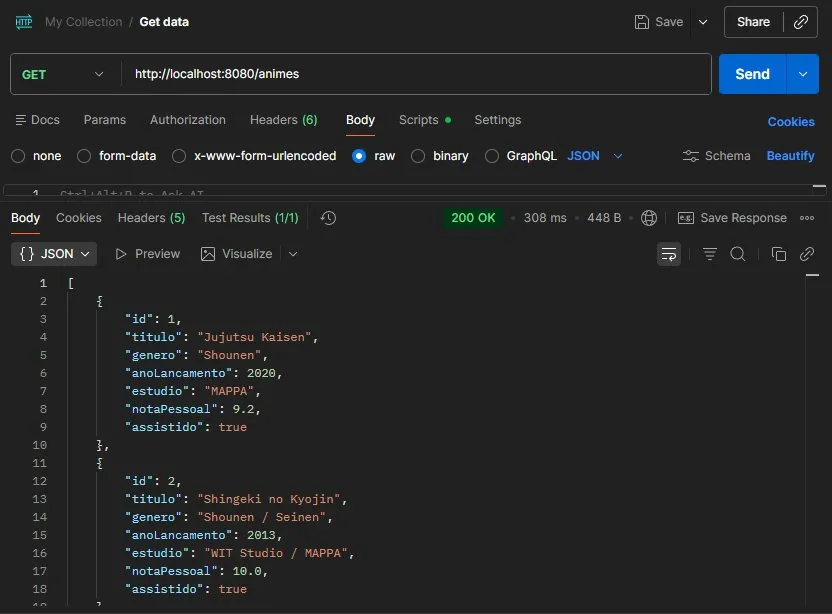
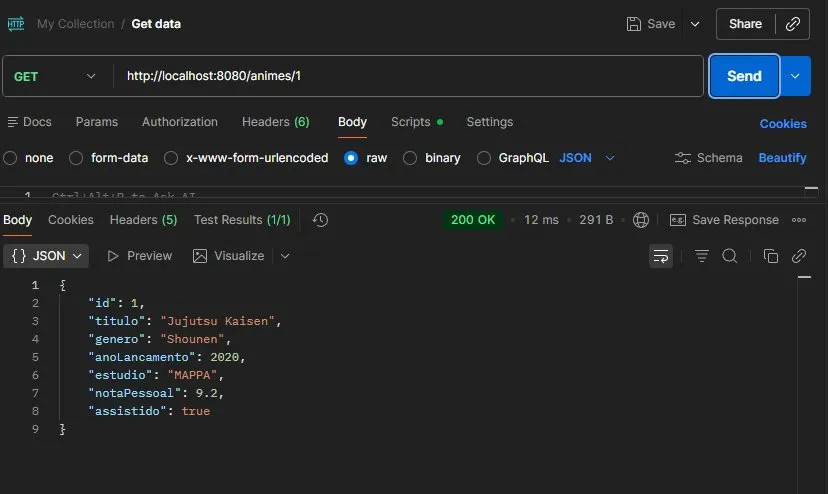
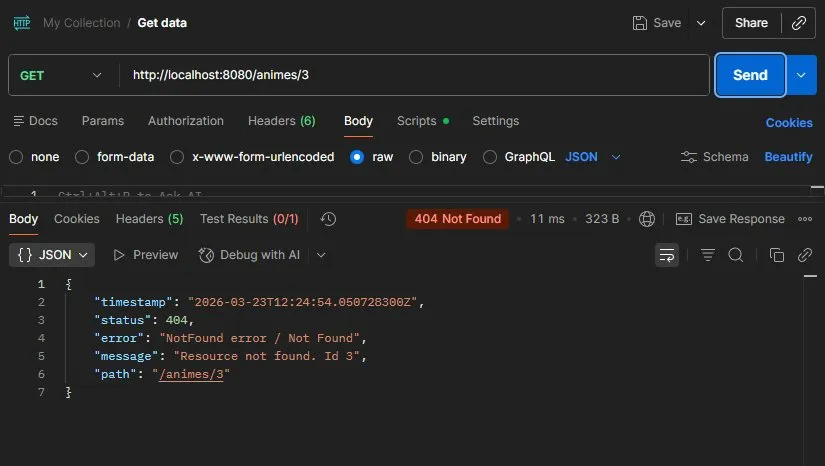
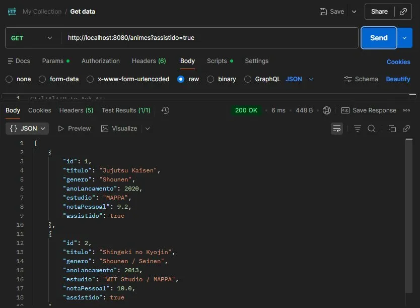
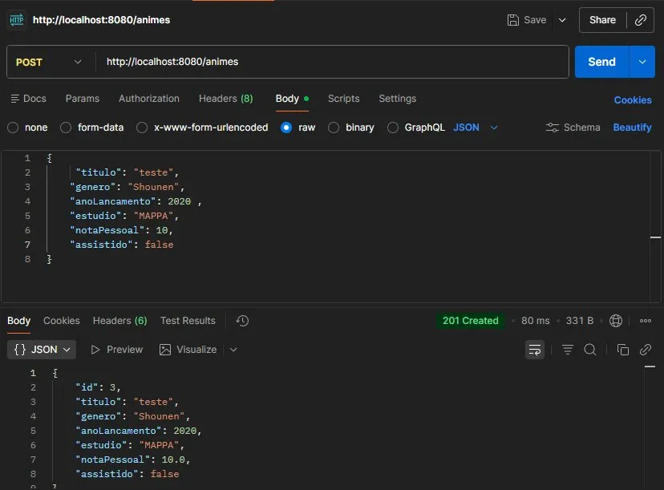
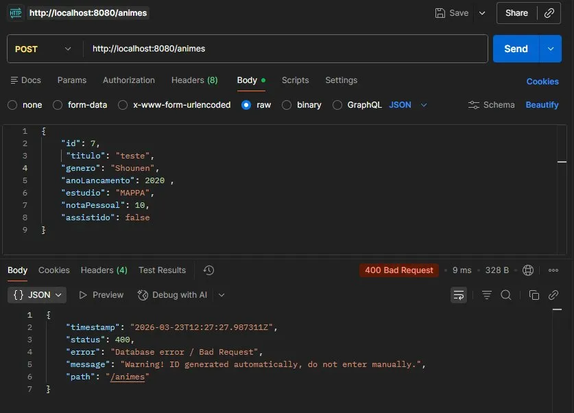
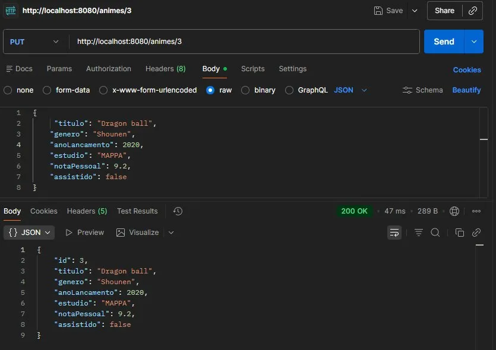
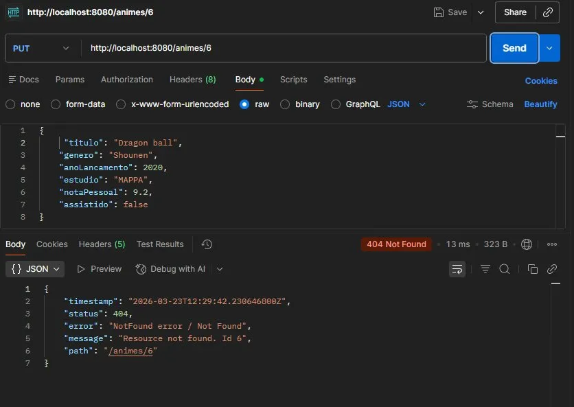
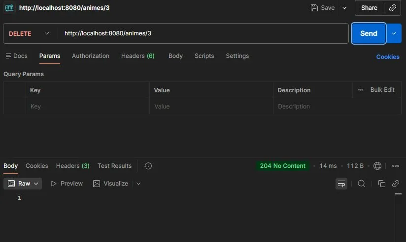
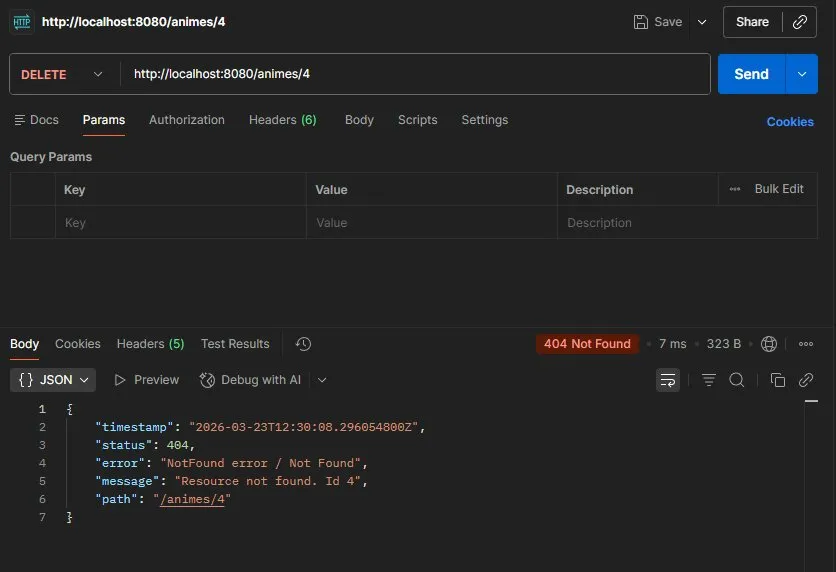

#  MyAnimeList-Pessoal

API RESTful para gerenciamento de animes favoritos, desenvolvida com Java + Spring Boot.

---

##  Como rodar o projeto

### Pré-requisitos

- Java 17 ou superior
- Maven

### Passos

```bash
# 1. Clone o repositório
git clone https://github.com/seu-usuario/MyAnimeList.git

# 2. Entre na pasta do projeto
cd MyAnimeList

# 3. Rode o projeto
./mvnw spring-boot:run
```

A API estará disponível em: `http://localhost:8080`

> O banco de dados H2 é criado automaticamente em memória ao iniciar a aplicação. Nenhuma configuração adicional é necessária.

---

## Endpoints

| Método | Endpoint | Descrição | Status Sucesso | Status Erro |
|--------|----------|-----------|----------------|-------------|
| POST | `/animes` | Cadastra um novo anime | 201 Created | 400 Bad Request |
| GET | `/animes` | Lista todos os animes | 200 OK | - |
| GET | `/animes?assistido=true` | Filtra por assistido | 200 OK | - |
| GET | `/animes/{id}` | Busca anime por ID | 200 OK | 404 Not Found |
| PUT | `/animes/{id}` | Atualiza um anime | 200 OK | 404 Not Found |
| DELETE | `/animes/{id}` | Remove um anime | 204 No Content | 404 Not Found |

---

## Exemplos com curl

### Cadastrar anime
```bash
curl -X POST http://localhost:8080/animes \
  -H "Content-Type: application/json" \
  -d '{
    "titulo": "Chainsaw Man",
    "genero": "Shounen",
    "anoLancamento": 2022,
    "estudio": "MAPPA",
    "notaPessoal": 9.8,
    "assistido": false
  }'
```

### Listar todos os animes
```bash
curl http://localhost:8080/animes
```

### Filtrar por assistido
```bash
curl http://localhost:8080/animes?assistido=true
```

### Buscar anime por ID
```bash
curl http://localhost:8080/animes/1
```

### Atualizar anime
```bash
curl -X PUT http://localhost:8080/animes/1 \
  -H "Content-Type: application/json" \
  -d '{
    "titulo": "Chainsaw Man",
    "genero": "Shounen",
    "anoLancamento": 2022,
    "estudio": "MAPPA",
    "notaPessoal": 10.0,
    "assistido": true
  }'
```

### Remover anime
```bash
curl -X DELETE http://localhost:8080/animes/1
```

---

## Testes no Postman

### GET /animes — 200 OK


### GET /animes/{id} — 200 OK


### GET /animes/{id} — 404 Not Found


### GET /animes?assistido=true — 200 OK


### POST /animes — 201 Created


### POST /animes — 400 Bad Request (ID informado manualmente)


### PUT /animes/{id} — 200 OK


### PUT /animes/{id} — 404 Not Found


### DELETE /animes/{id} — 204 No Content


### DELETE /animes/{id} — 404 Not Found


---

## 🛠 Tecnologias

- Java 17
- Spring Boot
- Spring Data JPA
- H2 Database (em memória)
- Bean Validation
